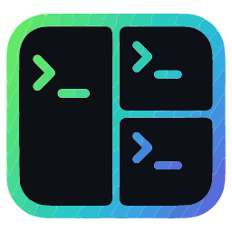

<p align="center">
  
</p>

<h1 align="center">Hyperpanes</h1>

> **An agent‑first tiling terminal workspace — name, color‑frame, and tear off panes into windows, then watch and drive your AI agents from one frameless app.**

<!-- Add a screenshot or GIF: drop the file at docs/screenshot.png and replace the block below with
      — a tiled, multi-pane layout shows the app off best. -->
<p align="center"><em>📸 Screenshot coming soon — see <code>docs/screenshot.png</code>.</em></p>

A desktop **terminal workspace**: tabbed windows that tile multiple live terminal panes, where each
pane is spawned with a **locked label** and its **own frame color**, arranged via **layout presets**.
Every tab is a self-contained workspace; panes and whole tabs can be **dragged between tabs and torn
off into separate windows**. Panes are created two ways — ad‑hoc through a **command palette** or the
**New pane** form, or in one shot from a declarative **`workspace.json`** file.

It's tmux's power (tiling, zoom) in a **native, GPU‑rendered** app — a single self‑contained binary
(no Electron, no browser) built on Slint, an `alacritty_terminal` VTE core, and real native shells
via `portable-pty` (ConPTY on Windows, Unix PTYs elsewhere) — plus first‑class named, color‑framed,
command‑driven panes and a browser‑like
tab/window model. Frameless, with its window controls built into an icon‑only top bar. Runs on
**Windows, Linux, and macOS**.

And it's **agent‑first**: AI panes glow when their agent goes quiet, and an opt‑in **Control API /
MCP** lets an agent — or a whole recursive agent org — watch and drive your panes (see
[Agents & the Control API](#agents--the-control-api-mcp)).

> [!NOTE]
> **Status: early days (native v0.0.9).** Hyperpanes was rebuilt from scratch as a **native Rust
> app** (Slint · `alacritty_terminal` · `portable-pty`) — one self‑contained binary for **Windows,
> Linux, and macOS**, replacing the original Electron build. Every feature below is implemented;
> expect rough edges on the newer cross‑platform ports, and please file issues. Prebuilt downloads
> are on the [Releases page](https://github.com/Eyalm321/hyperpanes/releases).

## Features

### Agents & automation
- **Idle‑agent glow** — panes running an agent CLI (claude, aider, codex, gemini, …) pulse when the
  agent goes quiet at its prompt, so you can see at a glance which one is waiting on you (effect
  styles under [Appearance](#customization-preferences)).
- **Ambient AI subtitles** — an optional local LLM (via Ollama) reads what each pane is doing and
  writes a live one‑line subtitle under its label, revealed with a typewriter effect.
- **Claude history** — browse past Claude Code conversations per project from the sidebar,
  full‑text search inside them, and click an entry to resume it in a pane.
- **Control API (MCP)** — an opt‑in loopback HTTP/WebSocket API that lets an agent or a companion
  MCP server read pane structure & output, stream activity/exit events, exchange messages between
  panes, and (after a second opt‑in) drive panes. Off by default, token‑authenticated, with
  capability‑scoped sub‑tokens. See [Agents & the Control API](#agents--the-control-api-mcp).

### Panes
- **Tiled panes** that stay mounted — switching layouts only restyles, so shells and scrollback
  always survive.
- **Locked labels** — name a pane; it never gets overwritten by the shell's title escape codes
  (the shell title shows only as a tooltip). Double‑click a label to rename; an optional subtitle
  rides along.
- **Per‑pane frame colors** — a palette + custom color picker (click the header dot).
- **Command panes** — launch a pane running any command (`npm run dev`, `tail -f log`, …) with live
  status, an exit‑code badge, and one‑click **Restart**.
- **Reminder panes** — set a reminder on a pane; a sidebar bell and a toast fire when it's due
  (click to jump back to the pane).
- **Maximize vs. fullscreen** — `⤢` (`Alt+Z`) maximizes a pane to fill its window; `⛶` (`F11`) takes
  it to OS fullscreen with the top bar hidden (hold `Esc` to exit).
- **Per‑pane font zoom** — `Ctrl +` / `Ctrl -` / `Ctrl 0`, or `Ctrl + mouse‑wheel`, with a live
  zoom‑% toast. Each pane remembers its own size.
- **Idle glow for AI panes** — when an agent CLI (claude, aider, codex, gemini, …) goes quiet at its
  prompt, its frame glows so you notice it's waiting for you — in one of five styles (**firefly,
  pulse, blink, fluorescent, solid**). Tunable threshold; off‑window panes glow even when focused.

### Layouts
- **Automatic** layout plus five presets: **Single, Columns, Rows, Grid, Main + Stack**.
  Automatic picks one for you by pane count (1 → single, 2–3 → columns, more → grid).
- **Draggable dividers** resize Columns, Rows, and the Main + Stack split.
- In **Single** layout the hidden panes appear as a **bottom taskbar** — click to switch,
  middle‑click to close, right‑click for the pane menu.
- Layout is **per tab**; set it from the top‑bar Layout menu, the command palette, or a tab's
  right‑click menu.

### Tabs & windows
- **Tabs are workspaces** — each tab has its own panes, layout, focus, zoom and split sizes, and
  keeps its shells running in the background.
- **Full tab lifecycle** — new, close, **reopen closed** (`Ctrl+Shift+T`), duplicate, rename
  (double‑click), reorder by dragging, cycle (`Ctrl+Tab` / `Ctrl+Shift+Tab`), plus **Close Others**
  and **Close Tabs to the Right**.
- **Multi‑window tear‑off** — drag a tab off the strip to pop it into its own window, or drag a
  **pane** out of its window to spin up a new one. Tabs and panes can be **dragged between existing
  windows** (Chrome‑style docking). "Move to New Window" / "Move to New Tab" are also in the menus.
  Live shells move with their pane — the pty stays alive across the move.
- **Drag & drop within a window** — drag a pane's header to another tab to move it, or onto a sibling
  pane to reorder/re‑slot it in the layout.

### Terminal
- **Native GPU renderer** — each pane's grid is rasterised with `swash` and composited by Slint
  (femtovg on the GPU, with a software fallback for headless/remote). No browser, no DOM.
- **Real native terminals** — shells run on actual OS PTYs via `portable-pty`: **ConPTY** on
  Windows (the build bundles a newer ConPTY redistributable next to the exe for throughput) and
  native Unix PTYs (openpty/forkpty) on Linux/macOS, parsed by an `alacritty_terminal` VTE core.
- **Per‑pane search** (`Ctrl+F`).
- **Copy‑on‑select** (auto‑copies the selection, with a toast) and **right‑click paste**.
- **Paste images into TUIs** — `Alt+V` forwards the clipboard image to an in‑pane program that reads
  it itself (e.g. Claude Code); a plain `Ctrl+V` auto‑forwards when the clipboard holds an image
  rather than text.
- **Clickable file paths** — paths in output are verified on disk, then **click to open** (in your
  editor or the OS default) and **Ctrl+click to copy** the resolved absolute path; `file:line:col`
  jumps are honored.
- **Per‑pane shell** override (`pwsh`, `cmd`, `/bin/zsh`, …) on top of a configurable default.

### Command palette
- **`Ctrl/Cmd+Shift+P`** — fuzzy runner for tabs (new/close/reopen), panes (new/shell/restart/close),
  zoom, layout switching, focus‑by‑pane, font zoom, preferences, open/save workspace, and
  diagnostics (**Performance: Dump metrics** — memory, processes, startup).

### Workspaces & sessions
- **Save/Open** the current tab to a `.json` file (top bar or palette).
- **Session restore** — the whole window (every tab + the active one) is auto‑saved and restored on
  next launch.
- **CLI launch** — open a `.json`, or describe panes inline with `-c`/`--label`/`--color`/… (see
  below).

### Customization (Preferences)
- **Keybindings** — every shortcut is rebindable with live conflict detection and per‑key / reset‑all.
- **Appearance** — frame‑color palette (**Muted / Vivid / Neon / Grayscale**, remapped by slot so a
  pane keeps its logical color), terminal color theme (**Dark / Black / Light / High contrast**),
  font family and default size, toggles for the pane frame and color dot, and the AI idle‑glow
  effect — all shown in a **live preview**.
- **General** — default shell, focused‑pane font size, clickable‑paths on/off with a custom editor
  command, and the **Control API** (agents / MCP) — a loopback API, off by default, with a second
  opt‑in before agents may send input to live shells.

## Install

Grab a prebuilt binary from the [**Releases page**](https://github.com/Eyalm321/hyperpanes/releases):

- **Linux** — `hyperpanes-<ver>-x86_64.AppImage` (`chmod +x` and run), or the `.deb` / `.rpm`.
- **macOS** — `hyperpanes-<ver>.dmg`.
- **Windows** — `hyperpanes-<ver>-setup.exe`.

Builds are currently unsigned, so your OS may warn on first launch.

## Build from source

The app is a Rust crate under `rs/crates/app` (its own standalone workspace — build it by path):

```bash
cargo build --release --manifest-path rs/crates/app/Cargo.toml
# → rs/crates/app/target/release/hyperpanes
```

You need a Rust toolchain plus the usual Slint/winit native build deps (fontconfig, freetype,
libxkbcommon, Wayland/X11, GL — see [`rs/packaging/linux/README.md`](rs/packaging/linux/README.md)).

### Package

Per‑OS scripts produce the release artifacts (each takes a bare `<version>`; output lands in
`rs/packaging/out/`):

```bash
bash rs/packaging/appimage.sh 0.0.9            # Linux AppImage
bash rs/packaging/deb.sh      0.0.9            # Linux .deb  (cargo-deb)
bash rs/packaging/rpm.sh      0.0.9            # Linux .rpm  (cargo-generate-rpm)
bash rs/packaging/macos/bundle.sh 0.0.9        # macOS .dmg
pwsh rs/packaging/build-installer.ps1 -Version 0.0.9   # Windows setup.exe
```

Pushing a `v<version>` tag runs all of these in CI and attaches them to a GitHub Release.

### Tests

```bash
cd rs && cargo test --all                                      # core workspace
cargo test --manifest-path rs/crates/terminal-widget/Cargo.toml
cargo test --manifest-path rs/crates/app/Cargo.toml
```

### Benchmarks

A separate **detect‑only** Node harness (`bench/`) compares Hyperpanes against other installed
terminals (throughput, startup, memory) — it never installs, updates, or changes anything on your
system.

```bash
npm install && npm run bench:detect   # list installed terminals → bench/results/terminals.json
npm run bench                         # run the suites           → bench/results/report.md
```

See [`bench/README.md`](bench/README.md) for suites, flags, and fairness caveats. Output lands in
`bench/results/` (gitignored).

## Workspace files

A workspace is a JSON file describing the panes and layout. Relative `cwd`s resolve against the
file's own directory. See [`workspaces/example.json`](workspaces/example.json) (Windows),
[`workspaces/example-unix.json`](workspaces/example-unix.json) (Linux/macOS), or
[`workspaces/claude-dev.json`](workspaces/claude-dev.json) — an agent-first preset with a Claude
pane, shell, git summary, and system monitor.

```json
{
  "name": "dev",
  "layout": "main-stack",
  "panes": [
    { "label": "server", "color": "#e5484d", "command": "npm run dev", "cwd": "." },
    { "label": "logs",   "color": "#f5a623", "command": "tail -f logs/app.log" },
    { "label": "db",     "color": "#30a46c", "command": "psql mydb" },
    { "label": "shell",  "color": "#3b82f6", "shell": "pwsh" }
  ]
}
```

Each pane may set its own `shell` (e.g. `pwsh`, `powershell`, `cmd`, `/bin/zsh`); omit it to use the
**Default shell** from Preferences, which itself falls back to the system shell (`COMSPEC` / `$SHELL`).
`layout` accepts `auto` · `single` · `columns` · `rows` · `grid` · `main-stack` (defaults to `auto`).

A saved file can also carry a **whole session** — multiple tabs via a `groups` array plus an `active`
index — which is exactly what the auto‑saved last session uses; a plain single‑tab file (above) still
loads fine. To open **several windows** at once, wrap tabs in a `windows` array — each entry is one
window with its own `groups` (and optional `bounds`):

```json
{
  "name": "dev",
  "windows": [
    { "title": "app", "groups": [{ "layout": "main-stack", "panes": [{ "command": "npm run dev" }] }] },
    { "title": "db",  "bounds": { "width": 900, "height": 600 },
      "groups": [{ "panes": [{ "command": "psql mydb" }] }] }
  ]
}
```

A tab (group) can also pin its split and selection: `sizes` (per‑pane fractions summing to 1),
`mainFraction` (the Main + Stack split), and `focused` / `zoomed` (pane **indices** for the
focused / maximized pane). Omit them for the defaults (equal split, first pane focused, none
maximized); bad values fall back safely.

Launch one directly:

```bash
hyperpanes ./workspaces/example.json
```

Or use **Open** / **Save** in the top‑bar menu (or the palette). The most recent session is remembered
and restored automatically on next launch.

### Launch from the command line

Skip the JSON file entirely and describe the panes inline. Each `-c` (or `--command`) opens a pane;
`--label`/`--color`/`--cwd`/`--shell`/`--font` attach to the `-c` before them. `--tab` and
`--window` separators start a new tab / window, so one launch can describe several windows, each
with its own tabs:

```bash
hyperpanes --window --name app --layout main-stack \
             -c "npm run dev" --label server --color "#e5484d" --cwd ./app --shell pwsh \
             -c "tail -f logs/app.log" --label logs --font 12 \
           --tab --name tests --layout columns \
             -c "vitest" --label unit \
           --window --name db \
             -c "psql mydb" --cwd ./db
```

| Flag | Meaning |
| --- | --- |
| `--window` | Start a new window (a following `--name`/`--layout` title/lay it out). |
| `--tab` | Start a new tab in the current window (auto-created if omitted). |
| `-c`, `--command <cmd>` | Open a pane running `<cmd>` (repeatable). |
| `-l`, `--label <name>` | Label the most recent `-c` pane (defaults to the command's first word). |
| `--color <hex>` | Frame color for the most recent `-c` pane. |
| `--font <px>` | Font size for the most recent `-c` pane. |
| `--cwd <dir>` | Working dir — per-pane after a `-c`, else a launch-wide default. |
| `--shell <shell>` | Shell — per-pane after a `-c`, else a default. E.g. `pwsh`, `powershell`, `cmd`, `/bin/zsh`. |
| `--layout <id>` | Current (or next) tab's layout: `auto` · `single` · `columns` · `rows` · `grid` · `main-stack`. |
| `--name <name>` | Titles the current scope: window (after `--window`), tab (after `--tab`), else the workspace. |

**New window vs. attach.** While the app is already running, a second `hyperpanes …` invocation
**attaches into the focused window** by default (its content shows up as new tab(s) there) rather than
spawning a separate window. Use a `--window` separator or `--new-window` when you actually want a new
window. Routing flags:

| Flag | Meaning |
| --- | --- |
| *(default)* | Attach the launched content into the **focused** window as new tab(s). |
| `--new-window` | Force a brand‑new OS window (today's pre‑attach behavior). |
| `--attach[=focused\|last\|<id>]`, `--into-current` | Attach into a specific existing window (default `focused`; `<id>` is a window id). |
| `--as tab` *(default)* / `--as panes` | Attach unit: each group as a new **tab**, or merge the panes into the target window's **active tab**. |

A `--window` separator implies new‑window intent, so the multi‑window example above still opens its
windows as new ones. `--attach` overrides that. A positional `.json` launch always opens new windows.

> [!TIP]
> Without any `--window`/`--tab` it stays the simple single-tab launch. Inline `-c` flags take
> precedence over a positional `.json` path. From a source build, run
> `cargo run --manifest-path rs/crates/app/Cargo.toml -- -c "…"` (args after the `--`). On a packaged
> install, call the `hyperpanes` executable (its
> install folder is added to `PATH`). hyperpanes runs as a **single instance**: a second
> `hyperpanes …` while it's open routes its content into the running app (attaching by default; see
> above).

## Keyboard shortcuts

All shortcuts below are **rebindable** in Preferences → Keybindings (except focus‑by‑number). `Ctrl`
means Ctrl on Windows/Linux and Cmd on macOS.

| Shortcut | Action |
| --- | --- |
| `Ctrl/Cmd+Shift+P` | Command palette |
| `Ctrl+T` | New tab |
| `Ctrl+Tab` / `Ctrl+Shift+Tab` | Next / previous tab |
| `Ctrl+Shift+T` | Reopen closed tab |
| `Alt+←/→/↑/↓` | Move focus to the adjacent pane |
| `Alt+1`…`Alt+9` | Focus pane by index (fixed) |
| `Alt+Z` | Maximize / restore the focused pane (within the window) |
| `F11` | Fullscreen the focused pane (hold `Esc` to exit) |
| `Ctrl+F` | Search within the focused pane |
| `Ctrl +` / `Ctrl -` / `Ctrl 0` | Font zoom in / out / reset (also `Ctrl`+mouse‑wheel) |

> [!NOTE]
> The palette uses `Ctrl/Cmd+Shift+P` rather than `Ctrl+K` on purpose — `Ctrl+K` is the shell's
> kill‑to‑end‑of‑line binding inside the terminal.

## Mouse & context menus

- **Tabs** — click to switch, double‑click to rename, `×`/middle‑click to close, `+` to add, drag to
  reorder or tear off. Right‑click for: New / Rename / Duplicate / Move to New Window / Close /
  Close Others / Close to the Right / Reopen / Layout.
- **Pane header** — drag to move the pane to another tab or out to a new window; the dot is the color
  picker. Right‑click for: New Pane / Rename / Change Color / Maximize / Fullscreen / Search /
  Restart / Copy / Paste / Select All / Clear / Move to New Tab / Move to Tab / Close.
- **Terminal body** — select to copy, right‑click to paste, `Ctrl`+wheel to zoom, click a path to
  open it.

## Agents & the Control API (MCP)

> [!WARNING]
> **Experimental, and off by default.** Turn it on only when you want to drive Hyperpanes from an
> agent. It's been exercised end‑to‑end — including recursive manager→worker agent orgs over the
> companion MCP server — but the surface is still evolving.

Hyperpanes can expose a **local control API** so an external agent — or a companion **MCP server**
(a separate project) — can observe and drive your panes. It's a loopback HTTP + WebSocket server
with a deliberately tight security posture:

- **Loopback only** — bound to `127.0.0.1` on an ephemeral port, never a routable interface.
- **Off until you opt in** — Preferences → General → **Control API (agents / MCP)** → *Allow agent
  control*. Nothing listens until you do.
- **Input is double‑gated** — reading pane structure/output is allowed once enabled, but typing into
  a live shell needs a second toggle (*allow input*).
- **Token‑authenticated** — every request carries a per‑instance bearer token. When enabled, the app
  writes `control.json` (port + token + event‑stream URL) into its user‑data folder; that's how a
  local client discovers the running instance.
- **Capability‑scoped** — a parent can mint *narrower*, optionally expiring sub‑tokens for child
  agents (no privilege escalation), so a recursive agent org hands each worker only its own subtree.

On top of read/input it offers an **event stream** (output / exit / activity), a per‑pane **message
bus**, advisory **write locks**, **clean‑output** mode (ANSI stripped), and structural **commands**
(open pane, set layout, …).

See [`docs/cli-multiwindow-mcp-plan.md`](docs/cli-multiwindow-mcp-plan.md) and
[`docs/agent-orchestration-plan.md`](docs/agent-orchestration-plan.md) for the design and status.

## Architecture

Three Rust crates under `rs/crates/`:

- **`core`** — the OS side, UI‑agnostic. `session_manager` + `session/` own the `portable-pty`
  shells (ConPTY on Windows, native Unix PTYs on Linux/macOS); output is decoded by an
  `alacritty_terminal` VTE and broadcast **by pane uid**, so a pty
  isn't tied to the window that spawned it — that's what lets a tab move between windows. `workspace/`
  is the `.hyperpanes` / `.json` model + file I/O, `cli/` parses launch args + routing,
  `shell_integration` injects the cwd/prompt hooks, `single_instance` is the launch lock + hand‑off,
  and `control/` is the opt‑in loopback agent/MCP server.
- **`terminal-widget`** — the Slint terminal pane. An `alacritty_terminal` grid → a `swash` glyph
  rasteriser → a `slint::Image` (a software path plus an optional shared‑device wgpu path), with
  selection, search, clickable links, and clipboard.
- **`app`** — the Slint GUI binary: windows, tabs, the pane tree + layout presets (a layout maps to
  an absolute rect per pane, so switching layouts only restyles and **never restarts a shell**),
  drag/tear‑off, preferences, the command palette, ambient‑AI subtitles (`ai.rs`), and Claude
  history (`history_scan.rs`). Panes carry a session uid so they detach/re‑attach across tab/window
  moves without killing the pty.

## Tech stack

Rust · [Slint](https://slint.dev) (GPU UI via femtovg/wgpu, with a software renderer) ·
[`alacritty_terminal`](https://github.com/alacritty/alacritty) (VTE) ·
[`portable-pty`](https://github.com/wezterm/wezterm) (ConPTY / Unix PTY) · `swash` (glyph
rasterisation) · `tokio` · `wgpu` · `arboard` (clipboard) · `reqwest` (self‑update + local‑LLM
subtitles).

## Acknowledgements

Built on [Slint](https://slint.dev) (UI), [`alacritty_terminal`](https://github.com/alacritty/alacritty)
(VTE), [`portable-pty`](https://github.com/wezterm/wezterm) (from WezTerm), and
[`swash`](https://github.com/dfrg/swash) (glyph rasterisation). Pane‑tree resize math and the
data‑batching session pattern are adapted from [vercel/hyper](https://github.com/vercel/hyper).
